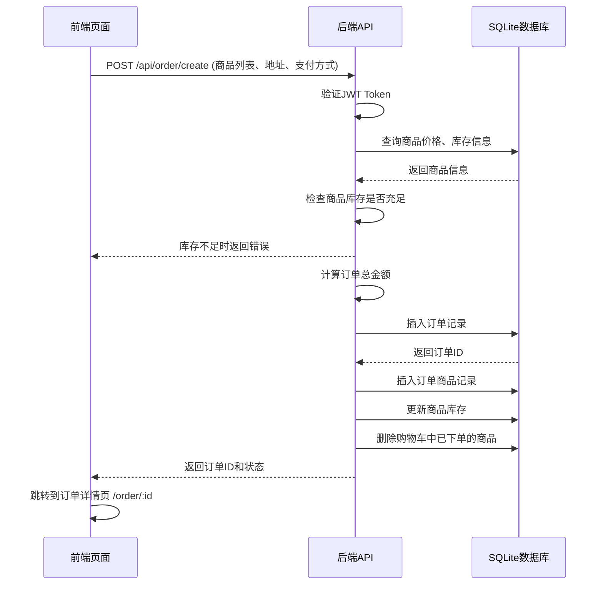

# 2310705207-洪堉铖的实验报告

# 实验内容

## 数据库设计

### 数据库选型
采用SQLite数据库，轻量级、无需安装，适合小型应用开发和学习使用。

### 核心实体设计

| 表名 | 主要功能 | 关键字段 |
|------|----------|----------|
| user | 用户基本信息 | id, username, password, privilege |
| user_info | 用户详细信息 | id, userId, nickname, avatar, gender, birthday, phone, email |
| book | 书籍信息 | id, name, publisher, author, price, categoryId, imageUrl, description, stock, soldCount |
| category | 书籍分类 | id, name, description |
| cart | 购物车 | id, userId, bookId, quantity |
| order | 订单 | id, userId, totalPrice, status, createdAt, updatedAt, userOrderNum |
| order_item | 订单商品 | id, orderId, bookId, quantity, price |
| address | 用户地址 | id, userId, province, city, district, detail, isDefault |
| favorite | 收藏 | id, userId, bookId, createdAt |
| comment | 评论 | id, bookId, userId, content, createdAt |
| rating | 评分 | id, bookId, userId, score, createdAt |
| reading_history | 阅读历史 | id, userId, bookId, lastReadTime |
| chat_message | 聊天消息 | id, senderId, receiverId, content, createdAt, isRead |
| friend | 好友关系 | id, userId, friendId, createdAt |
| friend_request | 好友请求 | id, senderId, receiverId, status, createdAt |
| notification | 通知 | id, userId, content, type, isRead, createdAt |
| payment_method | 支付方式 | id, userId, type, account, isDefault |

### 关系设计
- **用户与订单**：一对多关系，一个用户可以创建多个订单
- **订单与订单商品**：一对多关系，一个订单包含多个商品
- **用户与购物车**：一对多关系，一个用户对应多个购物车商品
- **用户与收藏**：一对多关系，一个用户可以收藏多本书籍
- **用户与阅读历史**：一对多关系，一个用户有多个阅读记录
- **用户与评论/评分**：一对多关系，一个用户可以对多本书进行评论和评分
- **书籍与评论/评分**：一对多关系，一本书有多个评论和评分
- **用户与好友**：多对多关系，通过friend表实现
- **用户与通知**：一对多关系，一个用户可以接收多个通知

## 项目架构

### 整体架构
采用前后端分离架构，前端使用Vue 3 + Vite + Vue Router + Pinia，后端使用Spring Boot + MyBatis-Flex + SQLite。

### 后端架构

**1. 核心模块**
- **实体层（Entity）**：定义数据库表对应的Java实体类，使用Lombok简化开发
- **Mapper层**：使用MyBatis-Flex实现数据库操作，无需编写SQL语句
- **Service层**：业务逻辑处理，包含接口和实现类
- **Controller层**：RESTful API接口，处理HTTP请求和响应
- **配置层（Config）**：包含安全配置、JWT认证、资源配置等
- **公共层（Common）**：包含全局异常处理、统一响应格式、工具类等

**2. 主要技术栈**
- Spring Boot 3.0+：后端框架
- MyBatis-Flex：ORM框架
- SQLite：数据库
- JWT：用户认证
- Spring Security：安全框架
- Lombok：简化Java代码

**3. 关键配置**
```yaml
spring:
  datasource:
    url: jdbc:sqlite:book_db.db  # SQLite数据库文件
    driver-class-name: org.sqlite.JDBC
  servlet:
    encoding:
      charset: UTF-8
      enabled: true
      force: true

mybatis-flex:
  type-aliases-package: com.example.book.entity
  configuration:
    log-impl: org.apache.ibatis.logging.stdout.StdOutImpl

server:
  port: 8088
  servlet:
    context-path: /
```

### 前端架构

**1. 核心模块**
- **视图层（Views）**：包含所有页面组件，如首页、书籍详情、购物车、订单等
- **组件层（Components）**：可复用的UI组件，如评论组件、星级评分组件、聊天窗口等
- **路由层（Router）**：定义前端路由，实现页面跳转和权限控制
- **状态管理（Store）**：使用Pinia管理全局状态，如购物车、收藏、用户信息等
- **工具层（Utils）**：包含Axios封装、用户工具等

**2. 主要技术栈**
- Vue 3：前端框架
- Vite：构建工具
- Vue Router：路由管理
- Pinia：状态管理
- Axios：HTTP客户端
- Element Plus：UI组件库

**3. 关键路由配置**
```javascript
const routes = [
  { path: '/', name: 'Home', component: () => import('../views/Home.vue') },
  { path: '/category/:id', name: 'Category', component: () => import('../views/Category.vue') },
  { path: '/book/:id', name: 'BookDetail', component: () => import('../views/BookDetail.vue') },
  { path: '/cart', name: 'Cart', component: () => import('../views/Cart.vue') },
  { path: '/order/confirm', name: 'OrderConfirm', component: () => import('../views/OrderConfirm.vue') },
  { path: '/order', name: 'Order', component: () => import('../views/Order.vue') },
  { path: '/profile', name: 'Profile', component: () => import('../views/Profile.vue') },
  // 管理员路由
  { path: '/admin/dashboard', name: 'AdminDashboard', component: () => import('../views/admin/AdminDashboard.vue') }
]
```

## 详细设计过程

### 订单创建流程设计

**1. 流程概述**
订单创建流程是用户从购物车选择商品到生成订单的完整过程，包含商品验证、库存检查、订单生成等关键步骤。

**2. 详细流程**



**3. 核心代码实现**

**前端订单确认页面**（OrderConfirm.vue）：
```vue
<template>
  <!-- 订单确认页面内容 -->
  <div class="order-confirm">
    <h2>确认订单</h2>
    <!-- 收货地址选择 -->
    <div class="address-section">
      <h3>收货地址</h3>
      <!-- 地址列表 -->
    </div>
    
    <!-- 商品列表 -->
    <div class="goods-section">
      <h3>商品列表</h3>
      <div v-for="item in cartItems" :key="item.bookId" class="goods-item">
        
        <div class="goods-info">
          <h4>{{ item.book.name }}</h4>
          <p class="price">¥{{ item.book.price }}</p>
          <p class="quantity">数量: {{ item.quantity }}</p>
        </div>
      </div>
    </div>
    
    <!-- 订单总价 -->
    <div class="total-section">
      <h3>订单总价: ¥{{ totalPrice }}</h3>
    </div>
    
    <!-- 提交订单按钮 -->
    <el-button type="primary" size="large" @click="submitOrder">提交订单</el-button>
  </div>
</template>

<script setup>
import { ref, computed, onMounted } from 'vue'
import { useRouter } from 'vue-router'
import axios from '../utils/axios'
import { useCartStore } from '../store/cartStore'

const router = useRouter()
const cartStore = useCartStore()
const cartItems = ref([])
const totalPrice = computed(() => {
  return cartItems.value.reduce((sum, item) => {
    return sum + item.book.price * item.quantity
  }, 0)
})

// 提交订单
const submitOrder = async () => {
  try {
    const response = await axios.post('/api/order/create', {
      items: cartItems.value.map(item => ({
        bookId: item.bookId,
        quantity: item.quantity
      })),
      // 其他订单信息
    })
    
    // 清空购物车
    cartStore.clearCart()
    
    // 跳转到订单详情页
    router.push(`/order/${response.data.data.id}`)
  } catch (error) {
    console.error('订单创建失败:', error)
  }
}
</script>
```

**后端订单Controller**（OrderController.java）：
```java
@RestController
@RequestMapping("/api/order")
public class OrderController {
    
    @Autowired
    private OrderService orderService;
    
    @PostMapping("/create")
    public Result createOrder(@RequestBody OrderCreateRequest request, HttpServletRequest httpRequest) {
        // 获取当前用户ID
        Integer userId = (Integer) httpRequest.getAttribute("userId");
        
        // 创建订单
        Order order = orderService.createOrder(userId, request);
        
        return Result.success(order);
    }
}
```

## 提高部分的设计

### 订单系统实现

**1. 订单状态管理**
- 订单状态：0-待付款, 1-待发货, 2-已发货, 3-已完成, 4-已取消
- 使用LocalDateTime记录订单创建和更新时间
- 为每个用户维护独立的订单序号（userOrderNum）

**2. 订单详情设计**
- 订单详情包含订单基本信息、商品列表、收货地址、支付信息等
- 支持订单状态跟踪和更新
- 支持订单取消和删除功能

**3. 订单分页查询**
- 实现了OrderPageResult类专门用于订单分页
- 支持按状态、时间等条件筛选订单

### 个人信息管理

**1. 用户信息模块**
- 分离了user（基本信息）和user_info（详细信息）两张表
- 支持用户昵称、头像、性别、生日、手机号、邮箱等信息的管理
- 实现了用户信息的修改和保存功能

**2. 头像上传功能**
- 使用了Spring Boot的MultipartFile处理文件上传
- 配置了文件存储路径和访问路径
- 实现了头像的上传、保存和显示功能
- 支持头像预览和更换

**3. 核心代码实现**

**后端文件上传配置**（ResourceConfig.java）：
```java
@Configuration
public class ResourceConfig implements WebMvcConfigurer {
    
    @Override
    public void addResourceHandlers(ResourceHandlerRegistry registry) {
        // 配置静态资源访问路径
        registry.addResourceHandler("/upload/**")
                .addResourceLocations("file:upload/");
    }
}
```

**后端UserInfoController**：
```java
@RestController
@RequestMapping("/api/user/info")
public class UserInfoController {
    
    @PostMapping("/avatar")
    public Result uploadAvatar(@RequestParam("file") MultipartFile file, HttpServletRequest request) {
        // 获取当前用户ID
        Integer userId = (Integer) httpRequest.getAttribute("userId");
        
        // 处理文件上传
        String avatarUrl = userInfoService.uploadAvatar(userId, file);
        
        return Result.success(avatarUrl);
    }
}
```

### 好友系统实现

**1. 功能概述**
- 好友请求发送和接收
- 好友关系管理（添加、删除、查看）
- 实时聊天功能
- 在线状态显示

**2. 核心设计**
- 使用friend表存储好友关系
- 使用friend_request表存储好友请求
- 使用chat_message表存储聊天消息
- 支持一对一实时聊天

### 通知系统实现

**1. 功能概述**
- 系统通知推送
- 通知类型分类（订单、好友、系统）
- 未读通知计数
- 通知标记已读

**2. 核心设计**
- 使用notification表存储通知信息
- 支持按类型和状态筛选通知
- 实现了通知的实时推送

## 完成时间

**开发周期**：2025年12月5日 - 2025年12月9日

**具体阶段**：
- 需求分析和数据库设计：2025年12月5日
- 后端API开发：2025年12月6日
- 前端页面开发：2025年12月7日-12月8日
- 功能测试和优化：2025年12月9日

## 意见和建议

1. **课程内容建议**
   - 增加前后端分离开发的实践课程
   - 引入更多现代化的开发工具和框架
   - 增加实际项目开发的案例分析

2. **技术学习建议**
   - 建议学习更多关于微服务架构的知识
   - 学习如何使用Docker进行项目部署
   - 学习如何进行单元测试和集成测试

3. **项目改进建议**
   - 引入Redis缓存提升系统性能
   - 实现更完善的权限管理系统
   - 增加数据分析和报表功能
   - 实现更多的社交功能，如用户动态、社区讨论等

4. **其他建议**
   - 建议提供更多的参考资料和学习资源
   - 组织学生进行项目交流和分享
   - 增加实际项目开发的指导和答疑时间